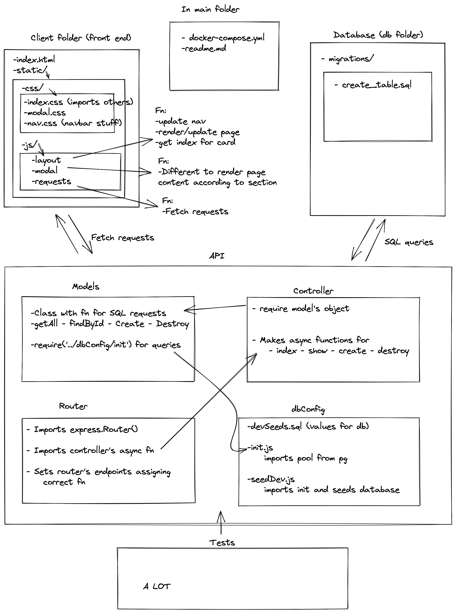

# LAP 2 - 24 Hour Challenge 

Inspired by [Telegraph](https://telegra.ph/)

# Installation & Usage

 - clone this repo and `cd` into folder `lap2_group_assignment`

 - run `bash _scripts/startDev.sh` to start api & db services

  - To start client, open `index.html` filr with your browser

  - To access server, visit `localhost:3000`

## Planning stage

## Wins & Challenges

### Wins

- Good planning  GItHub project

### Challenges

- ....

## Contributors

Group challenge done by: 

- <a href="https://github.com/Gioele-M">Gioele Montis</a>
- <a href="https://github.com/Igormirowski">Igor Mirowski</a>

# remember :
correct post.js if necessary
